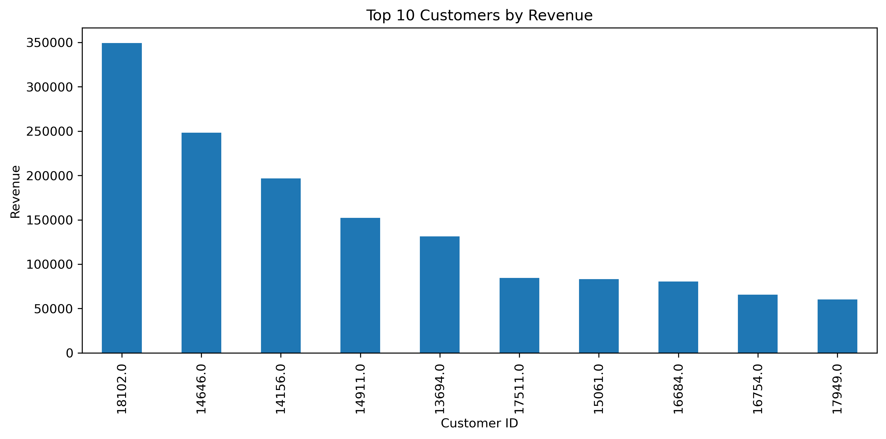

# 🛒 E-Commerce Sales Analysis

## 📌 Project Overview

This project analyzes an online retail dataset to uncover sales trends, customer behavior, and business insights using Python.

The analysis includes data cleaning, exploratory data analysis (EDA), feature engineering, and data visualization.

---

## 📂 Dataset

- **Source:** Online Retail II Dataset (UCI Machine Learning Repository)
- **Rows (before cleaning):** 525,461
- **Rows (after cleaning):** 400,916
- **Columns:** 9

---

## 🛠 Technologies

- Python
- Pandas
- Matplotlib
- Jupyter Notebook
- Git & GitHub

---

## 📊 Data Cleaning

The following preprocessing steps were applied:

- Removed duplicate records
- Removed rows with missing Customer ID
- Removed transactions with negative or zero Quantity
- Removed transactions with negative or zero Price
- Created a new feature: **TotalPrice = Quantity × Price**

---

## 📈 Exploratory Data Analysis

The project answers questions such as:

- What are the best-selling products?
- Which countries generate the highest revenue?
- Who are the most valuable customers?
- How is revenue distributed across countries?

---

## 📷 Visualizations

### Top 10 Best Selling Products


---

### Top 10 Countries by Revenue


---

### Top 10 Customers by Revenue



---

## 📁 Project Structure

```
e-commerce-sales-analysis
│
├── data
│   └── online_retail_II.xlsx
│
├── notebooks
│   └── analysis.ipynb
│
├── images
│   ├── top_products.png
│   ├── top_countries.png
│   └── top_customers.png
│
├── sql
│
├── .gitignore
└── README.md
```

---

## 🚀 Future Improvements

- Monthly sales trend analysis
- RFM customer segmentation
- SQL analysis queries
- Interactive Power BI dashboard

---

## 👩‍💻 Author

**Beyzanur Dündar**

Mathematics Student at Marmara University

Aspiring Data Analyst

